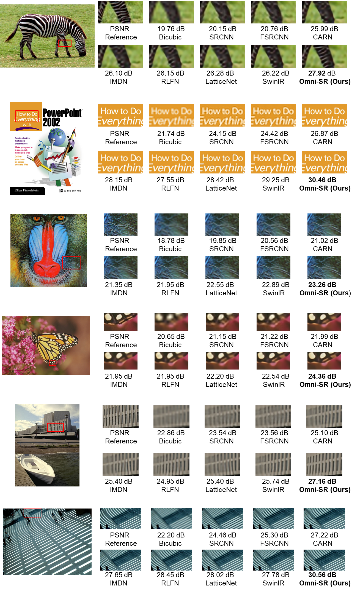

# Omni Aggregation Networks for Lightweight Image Super-Resolution (OmniSR)
## Accepted by CVPR2023

**The official repository with Pytorch**

Our paper can be downloaded from [[Arxiv]](https://arxiv.org/pdf/2304.10244.pdf).
 

## Installation
**Clone this repo:**
```bash
git clone https://github.com/Francis0625/OmniSR.git
cd OmniSR
```
**Dependencies:**
- PyTorch>1.10
- OpenCV
- Matplotlib 3.3.4 
- opencv-python 
- pyyaml
- tqdm
- numpy
- torchvision

## Preparation

- Download pretrained models, and copy them to ```./train_logs/```:

|  Settings   | CKPT name | CKPT url|
|  ----  | ----  | --- |
| DIV2K $\times 2$  | OmniSR_X2_DIV2K.zip | [baidu cloud](https://pan.baidu.com/s/1dJhTlhloaiYn9yImk6pa1Q) (passwd: sjtu) , [Google driver](https://drive.google.com/file/d/18lSvJq9CGCwDomkas2gh8K6UOq8qRLIw/view?usp=sharing)|
| DF2K $\times 2$  | OmniSR_X2_DF2K.zip | [baidu cloud](https://pan.baidu.com/s/1IK_bzB5gp2tK67zF-VV4Lg) (passwd: sjtu) , [Google driver](https://drive.google.com/file/d/12EvHRof0-kA2Wt_BzfFJBK1J0jbzfz-4/view?usp=sharing)| 
| DIV2K $\times 3$  | OmniSR_X3_DIV2K.zip | [baidu cloud](https://pan.baidu.com/s/19J5uONEOYWxAbEMWIF9qDA) (passwd: sjtu) , [Google driver](https://drive.google.com/file/d/1Rwg6o-RGC-TEiyVSVT9FS1iHjx5n948h/view?usp=sharing)|
| DF2K $\times 3$  | OmniSR_X3_DF2K.zip | [baidu cloud](https://pan.baidu.com/s/1mXL7AOUwyC91UDcEWFCh2Q) (passwd: sjtu) , [Google driver](https://drive.google.com/file/d/198R2c3nlyhL4FxMJSC_gccyL3O1gH_K6/view?usp=sharing)| 
| DIV2K $\times 4$  | OmniSR_X4_DIV2K.zip | [baidu cloud](https://pan.baidu.com/s/1kGasS_wslZy4OyzaHTukvg) (passwd: sjtu) , [Google driver](https://drive.google.com/file/d/1VoPUw0SRnCPAU8_R5Ue15bn2gwSBr97g/view?usp=sharing)|
| DF2K $\times 4$  | OmniSR_X4_DF2K.zip | [baidu cloud](https://pan.baidu.com/s/1ovxRa4-wOKZLq_nO6hddsg) (passwd: sjtu) , [Google driver](https://drive.google.com/file/d/17rJXJHBYt4Su8cMDMh-NOWMBdE6ki5em/view?usp=sharing)|

- Download benchmark ([baidu cloud](https://pan.baidu.com/s/1HsMtfjEzj4cztaF2sbnOMg) (passwd: sjtu) , [Google driver](https://drive.google.com/file/d/1w-brbpprWHyT4tzCe_MoB2tqEcSOc5OW/view?usp=sharing)), and copy them to ```./benchmark/```. If you want to generate the benchmark by yourself, please refer to the official repository of [RCAN](https://github.com/yulunzhang/RCAN).
 
## Evaluate Pretrained Models
### Example: evaluate the model trained with DF2K@X4:

- Step 1, the following cmd will report a performance evaluated with python script, and generated images are placed in ```./SR```

```
python test.py -v "OmniSR_X4_DF2K" -s 994 -t tester_Matlab --test_dataset_name "Urban100"
```
- Step2, please execute the ```Evaluate_PSNR_SSIM.m``` script in the root directory to obtain the results reported in the paper. Please modify ```Line 8 (Evaluate_PSNR_SSIM.m): methods = {'OmniSR_X4_DF2K'};``` and ```Line 10 (Evaluate_PSNR_SSIM.m): dataset = {'Urban100'};``` to match the model/dataset name evaluated above.

## Training

- Step1, please download training dataset from [DIV2K](https://data.vision.ee.ethz.ch/cvl/DIV2K/) (```Train Data Track 1 bicubic downscaling x? (LR images)``` and ```Train Data (HR images)```), then set the dataset root path in ```./env/env.json: Line 8: "DIV2K":"TO YOUR DIV2K ROOT PATH"```

- Step2, please download benchmark ([baidu cloud](https://pan.baidu.com/s/1HsMtfjEzj4cztaF2sbnOMg) (passwd: sjtu) , [Google driver](https://drive.google.com/file/d/1w-brbpprWHyT4tzCe_MoB2tqEcSOc5OW/view?usp=sharing)), and copy them to ```./benchmark/```. If you want to generate the benchmark by yourself, please refer to the official repository of [RCAN](https://github.com/yulunzhang/RCAN).

- Step3, training with DIV2K $\times 4$ dataset:
```
python train.py -v "OmniSR_X4_DIV2K" -p train --train_yaml "train_OmniSR_X4_DIV2K.yaml"
```


## Visualization



## Results

[result.tex](https://github.com/Francis0625/Omni-SR/blob/main/result.tex) is the corresponding tex code for result comparison.

## Related Projects

## License
This project is released under the Apache 2.0 license. 

## To cite our paper
If this work helps your research, please cite the following paper:

```
@inproceedings{omni_sr,
  title      = {Omni Aggregation Networks for Lightweight Image Super-Resolution},
  author     = {Wang, Hang and Chen, Xuanhong and Ni, Bingbing and Liu, Yutian and Liu jinfan},
  booktitle  = {Conference on Computer Vision and Pattern Recognition},
  year       = {2023}
}
```
